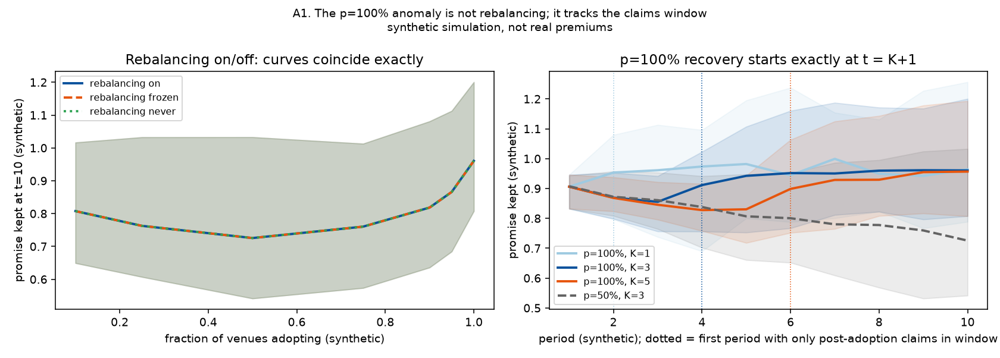
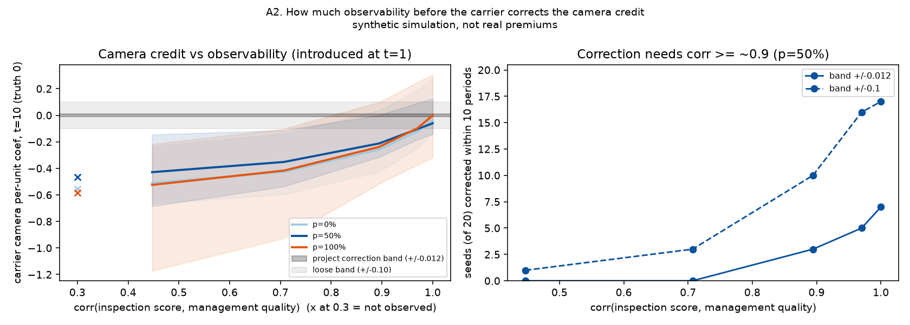
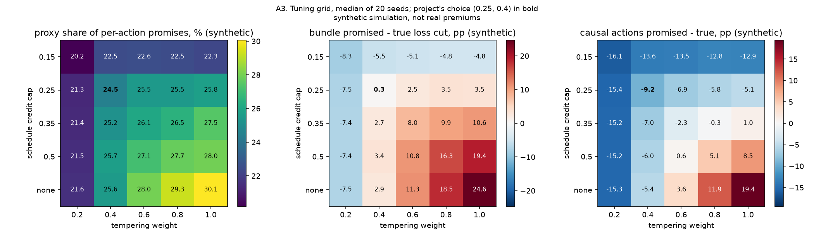

# Audit of the savings-score simulation

Every number, table and figure here comes from the synthetic simulation in this repository.
None of it is a claim about real premiums, carriers or Third Space's product. Statistics are
median [min, max] over the project's 20 seeds unless stated otherwise.

`harness.py` imports the project unchanged and subclasses its `Carrier` to expose the credit
cap, the tempering weight, the base-rate rebalancing, and an optional management-quality proxy.
With default settings it reproduces [`results/stress_periods.csv`](../results/stress_periods.csv) to CSV precision
(max abs diff 1.5e-6; `check_harness.py`). I did not modify any project file.

## Summary

| question | verdict |
|---|---|
| 1. Is the p = 100% recovery a rebalancing artifact? | No. Rebalancing cancels out of the metric exactly. The recovery is an identification artifact: once the carrier's claims window has no unmoved venue-years left, it re-learns the confounded slope. Rebalancing does decide Finding 6, whether the carrier or the non-adopters pay. |
| 2. Is "carrier never corrects" only identifiability? | Robust as an identification result, but the headline statistic is inflated by the tolerance band. Correction needs a management proxy with corr ≈ 0.9 or better: about half of seeds correct at 0.89, and 12-16 of 20 at 0.97. The ±0.012 band is below the estimator's noise, so even a perfectly informed carrier fails it in most seeds. |
| 3. Do headlines survive the cap/tempering grid? | Mostly. Two are fragile: the bundle looking calibrated (holds only at the chosen tuning) and causal actions being under-credited (the sign flips when the schedule is loosened). |

---

## Q1. The 100% adoption anomaly

What I ran: `q1_full_adoption.py`, p ∈ {0.1, 0.25, 0.5, 0.75, 0.9, 0.95, 1.0}, K = 3, 20 seeds,
under three rebalancing modes. "On" is the project default. "Frozen" fixes the off-balance at its
burn-in value, which switches rebalancing off after t = 0. "Never" keeps the off-balance at 0.
`q1_mechanism.py` adds post-adoption book diagnostics and a jittered-target test, `q1_p0.py`
gives the p = 0 references, and the K sweep comes from the project's own CSV.

Rebalancing has no effect on the anomaly, by construction. The realized cut is 1 − r_new / r_old,
with both rates from the same carrier in the same period. The off-balance is one scalar multiplied
into both, so it cancels, and it never feeds back into the GLM, which is fit on claims only.
Numerically, promise kept is identical across modes (max |diff| = 4e-16 for frozen vs on, 3e-13
for never vs on). So is the non-causal share (max |diff| 1e-16).

*Table 1.1 (synthetic). Promise kept (realized / promised) at t = 10, K = 3; identical in all three rebalancing modes.*

| p | 0.5 | 0.75 | 0.9 | 0.95 | 1.0 |
|---|---|---|---|---|---|
| kept, t = 10 | 0.726 [0.542, 1.033] | 0.760 [0.574, 1.013] | 0.818 [0.636, 1.081] | 0.866 [0.685, 1.113] | 0.961 [0.808, 1.201] |

There is no jump at p = 1. The curve is U-shaped with its minimum near p = 0.5 and rises
smoothly through 0.9 and 0.95.

The cause is the carrier's cross-sectional identification, and the timing shows it. At p = 100%,
promise kept declines like partial adoption until the refit window first holds only post-adoption
years, then jumps. That happens at t = K + 1 for every K:

*Table 1.2 (synthetic). Promise kept at p = 100%, median, from the project's own K sweep.*

| K | kept at t = K | kept at t = K + 1 | kept at t = 10 | for comparison: p = 50%, t = 10 |
|---|---|---|---|---|
| 1 | 0.906 (t=1) | 0.953 | 0.964 | 0.722 |
| 3 | 0.855 | 0.911 | 0.961 | 0.726 |
| 5 | 0.830 | 0.899 | 0.957 | 0.750 |

While the window mixes pre- and post-adoption years, the same venues appear with old and new
features and unchanged management quality. That within-venue contrast pulls the carrier's
coefficients toward their causal values, and credits shrink. Partial adoption keeps a similar
contrast in the cross-section, because adopters' features moved while their management quality
did not. The staff-training per-unit coefficient at t = 10 is −0.70 at p = 0.5 and −0.60 at
p = 0.75, against a truth of −0.60 and a t = 1 value of −0.99.

At p = 100% no unmoved venue-years remain after t = K. Every venue below the 75th percentile of a
chosen feature now sits exactly on it: 61% of the book is at the training target, and training's
SD falls from 0.256 to 0.087. What variation is left comes from the naturally high, confounded
tail, so coefficients rebound past their pre-adoption level. Training reaches −1.54 [−2.02, −1.05]
at t = 10, and 55% of adopters hit the credit cap (21% at p = 0.5).

Decomposing adopters' realized log rate change at t = 10 (p = 0.5 → p = 1.0): training contributes
−0.064 → −0.143, late-night hours −0.062 → −0.104, and response time −0.035 → −0.050. The rest is
spread across the other features, and the cap claws back +0.023 → +0.089. Every credit re-inflates,
not only training.

In the jitter test, adopters overshoot their target by |N(0, 0.5·SD)| instead of piling up on it.
That cuts the training coefficient at p = 100% from −1.54 to −1.03, but promise kept only moves
from 0.961 to 0.936, because most adopters are still at the credit cap. The pile-up amplifies the
effect; window composition is the main cause.

A promise kept of 0.96 at p = 100% therefore means the carrier is over-crediting again. It coincides
with the highest peak loss ratio (1.055) and the lowest non-causal share of any p
(0.199 [0.093, 0.266], against 0.247 at p = 0.5).

Rebalancing does drive Finding 6. The loss-ratio and spillover numbers depend on it:

*Table 1.3 (synthetic). Peak loss ratio over 10 periods, and non-adopters' rate change vs p = 0 at t = 10.*

| p | peak LR, rebalancing on | peak LR, frozen | peak LR, never | non-adopter change, on | non-adopter change, frozen / never |
|---|---|---|---|---|---|
| 0 | 0.755 [0.737, 0.780] | 0.761 [0.741, 0.790] | 0.904 [0.877, 0.953] | | |
| 0.5 | 0.841 [0.788, 0.872] | 0.713 [0.690, 0.748] | 0.855 [0.808, 0.909] | −5.4 pp [−7.9, −2.5] | +14.1 pp [10.9, 19.3] |
| 0.95 | 1.019 [0.937, 1.069] | 0.691 [0.658, 0.736] | 0.818 [0.770, 0.895] | −9.0 pp [−13.5, −3.6] | +36.4 pp [29.6, 51.5] |
| 1.0 | 1.055 [0.962, 1.105] | 0.688 [0.653, 0.732] | 0.813 [0.762, 0.887] | | |

With rebalancing on, the carrier re-bases to its own GLM's indicated level. That GLM over-credits the
adopters' moved features, so everyone's base rate falls and the carrier loses money. With rebalancing
off, the refit's intercept rises instead: non-adopters subsidize, and the carrier's loss ratio improves
with adoption. The report's reason for adding rebalancing (A12: premiums drifted to about 2× losses)
does not reproduce in the current code. With the off-balance frozen, premiums are about 1.45× true loss
at p = 100%, against the 1.35 load.

Verdict (Q1): the rebalancing hypothesis is rejected. The p = 100% recovery is an artifact of the
carrier's identification (window composition plus a common adoption target) and says nothing about
the score. The number itself is stable under all rebalancing modes and across the whole Q3 grid,
where kept(p=1) − kept(p=0.5) runs from +0.10 to +0.40; reading it as a recovery is wrong. Finding 6's
"who pays" is an artifact of rebalancing (A12).

---

## Q2. "Carrier never corrects"

What I ran: `q2_observability.py`. Each venue gets `inspection_score = management_quality + σ·ε`,
with ε from a separate RNG stream so nothing else in the world changes. Noise levels are none (not
observed), high σ = 2 (corr with management 0.45), medium σ = 1 (0.71) and low σ = 0.5 (0.89),
plus very low σ = 0.25 (0.97) and zero (1.00) to find the threshold. The carrier rates the score as a
directly rated exposure feature, using the project's unchanged learning rule.

In the primary variant ("t1") the carrier starts rating the score at t = 1, with its coefficient at 0
and every other coefficient at the project's miscalibrated burn-in values. That is what time to
correction means. In the "burn-in" variant the carrier has rated it all along, which shows how wrong
it is at t = 0.

K = 3, p ∈ {0, 0.5, 1}, horizon extended to 20. Time to correction uses the project's definition,
learning periods until |camera coef − truth| ≤ band, with two bands: the project's ±0.012 and a
loose ±0.10 (80% of the initial −0.50 bias removed).

*Table 2.1 (synthetic). Variant t1, p = 50%. Seeds corrected (of 20), median periods among those corrected.*

| proxy noise | corr(proxy, mgmt) | camera coef t = 10 (truth 0) | ±0.012 within 10 | ±0.012 within 20 | ±0.10 within 10 | ±0.10 within 20 | non-causal share t = 10 |
|---|---|---|---|---|---|---|---|
| none (project) | | −0.464 [−0.766, −0.159] | 0/20 | 1/20 (19) | 0/20 | 3/20 (13) | 0.247 [0.140, 0.381] |
| high | 0.45 | −0.429 [−0.686, −0.145] | 0/20 | 2/20 (14) | 1/20 (6) | 3/20 (11) | 0.236 [0.119, 0.373] |
| medium | 0.71 | −0.352 [−0.537, −0.114] | 0/20 | 1/20 (13) | 3/20 (5) | 8/20 (12) | 0.208 [0.080, 0.354] |
| low | 0.89 | −0.212 [−0.315, 0.001] | 3/20 (5) | 6/20 (10) | 10/20 (4) | 14/20 (5) | 0.137 [0.012, 0.313] |
| very low | 0.97 | −0.103 [−0.183, 0.093] | 5/20 (5) | 10/20 (10) | 16/20 (4) | 20/20 (6) | 0.069 [0.000, 0.273] |
| zero (oracle) | 1.00 | −0.060 [−0.141, 0.124] | 7/20 (7) | 14/20 (10) | 17/20 (4) | 20/20 (4) | 0.043 [0.000, 0.246] |

*Table 2.2 (synthetic). Same, other adoption levels: seeds corrected within 10 periods, ±0.10 band (±0.012 band in brackets).*

| p | none | high | medium | low | very low | zero |
|---|---|---|---|---|---|---|
| 0 | 0 (0) | 0 (0) | 0 (0) | 3 (1) | 12 (3) | 18 (7) |
| 1.0 | 0 (0) | 0 (0) | 2 (0) | 8 (2) | 16 (5) | 17 (10) |

*Table 2.3 (synthetic). Variant burn-in: the carrier has always seen the proxy. Values at t = 0 (identical across p).*

| proxy noise | none | high | medium | low | very low | zero |
|---|---|---|---|---|---|---|
| camera coef at t = 0 | −0.503 [−1.037, −0.325] | −0.473 [−1.003, −0.293] | −0.396 [−0.899, −0.173] | −0.235 [−0.696, 0.059] | −0.077 [−0.511, 0.243] | 0.030 [−0.375, 0.323] |
| non-causal share of carrier credit | 0.215 [0.159, 0.322] | 0.211 | 0.195 | 0.147 | 0.081 | 0.039 |

The identification story holds. A medium-quality inspection score (corr 0.71) leaves the camera credit
at −0.35 to −0.43 and the non-causal share near 0.20, and it corrects in at most 3 of 20 seeds within
10 periods even under the loose band. At corr 0.89, 3 to 10 of 20 seeds correct within 10 periods,
depending on p; a clear majority (12-16 of 20) needs corr ≈ 0.97. Once the proxy is good enough,
correction takes about 4-6 periods, set by the 35% partial-update rule, so that update rate is a lag
that matters once identification is possible.

The project's band makes "never" close to automatic, for two reasons. First, even with a perfect
proxy the per-seed camera coefficient at t = 10 spans [−0.14, +0.12], ten times the ±0.012 band, and
an oracle carrier meets that band within 10 periods in only 7/20 seeds at p = 50% (10/20 at
p = 100%). Second, from −0.50 with 35% partial updates the gap after n updates is 0.50 · 0.65ⁿ, so
getting within 0.012 needs n ≥ 9: the last update inside the 10-period horizon, even if every refit
returned exactly 0. Table 2.1 is more informative than the 20/20 count.

Better observability also lowers promise kept. At p = 50%, kept at t = 10 falls from 0.726 (none)
through 0.671 (medium) to 0.510 (oracle). A carrier that learns more honors less of the score's
promise, which fits the promise being partly unbacked.

Verdict (Q2): the qualitative claim is robust. In this model the non-correction is a consequence of
identifiability, and fixing it within 10 periods takes a near-perfect proxy (corr ≈ 0.9 to 0.97). The
quantitative framing ("never within tolerance, 20/20 seeds, every p") is an artifact of a tolerance
band that sits below the estimator's noise floor and at the edge of what the update rule allows in
10 periods.

---

## Q3. Sensitivity to the post-hoc tuning

What I ran: `q3_tuning.py`, credit cap ∈ {0.15, 0.25, 0.35, 0.50, none} × tempering weight ∈
{0.2, 0.4, 0.6, 0.8, 1.0}, 25 cells × 20 seeds. The carrier, quotes, score and recommendations are
rebuilt in every cell. Rebalancing stays on, since Q1 covers it. Each cell gets the t = 0 static
headline, adoption runs at p ∈ {0.25, 0.5, 1.0} (K = 3), and the camera true-effect sweep
{0, 0.1, 0.3} × training's effect at p = 0.5.

"Dose-response" is ambiguous in the report, so I tested both readings: adoption level against promise
kept (the U-shape), and proxy true effect against non-causal share (Finding 5). The full tables are
the output of `q3_analyze.py`.

*Table 3.1 (synthetic). Headline metrics across the 25-cell grid: range of cell medians, with the chosen cell (0.25, 0.4) in the third column.*

| metric | project value | at (0.25, 0.4) | range of cell medians | holds? |
|---|---|---|---|---|
| proxy share of summed per-action promises, t = 0 | 24.5% | 24.5 [18.6, 36.2] | 20.2 to 30.1% | yes, 20-30% everywhere |
| bundle promised − true loss cut, t = 0 | +0.4 pp (31.9 vs 31.5) | +0.3 [−3.3, 5.5] | −8.3 to +24.6 pp | no: within ±1 pp only at the chosen cell |
| causal actions: summed promised − true, t = 0 | under-credited | −9.2 [−15.0, −1.4] | −16.1 to +19.4 pp | no: negative in 18/25 cells, positive when cap ≥ 0.35 and weight ≥ 0.6 |
| proxy-heavy adopters: realized − true, t = 1, p = 0.5 | +9.8 pp | +9.8 [5.3, 16.8] | +5.6 to +35.6 pp | sign yes (every cell), magnitude no |
| causal-only adopters: realized − true, t = 1, p = 0.5 | −7.2 pp | −7.2 [−12.1, −3.2] | −12.6 to +11.7 pp | no: positive in 6/25 cells |
| proxy-heavy minus causal-only (difference of medians) | ~17 pp | 17.0 | 16.5 to 23.9 pp | yes |
| promise kept t = 10, p = 0.5 | 0.73 | 0.73 [0.54, 1.03] | 0.64 to 0.83 | level varies, decay holds |
| p = 0.5 is the worst adoption level (seeds per cell) | | 17/20 | 13/20 to 20/20 | yes |
| kept(p = 1) − kept(p = 0.5), t = 10 | +0.23 | +0.22 [0.15, 0.27] | +0.10 to +0.40 | yes, positive in every seed of every cell |
| non-causal share of carrier credit, t = 10, p = 0.5 | 0.25 | 0.25 [0.14, 0.38] | 0.22 to 0.27 | yes |
| camera per-unit coef, t = 10, p = 0.5 (truth 0) | −0.46 | −0.46 [−0.77, −0.16] | −0.33 to −0.50 | yes |
| non-causal share falls with camera true effect 0 → 0.1 → 0.3 | 0.25/0.18/0.13 | 0.25/0.18/0.13 | monotone in 80-100% of seeds per cell | yes; flatter with loose schedules (0.27/0.26/0.22 uncapped, weight 1) |
| peak loss ratio, p = 1 | 1.06 | 1.06 [0.96, 1.10] | 1.03 to 1.19 | yes across the grid, but reverses without rebalancing (Q1) |

The bundle only looks calibrated where two errors happen to cancel. Proxies are always over-promised
(20-30% of the per-action total), and whether the real reducers are under-credited depends on how
hard the cap and tempering compress the schedule. At weight 0.2 everything is under-credited (bundle
−8 pp). With a loose schedule both proxies and causal features are over-credited, because the GLM's
causal coefficients are confounded too (training −0.99 vs a truth of −0.60), and the bundle
over-promises by up to +25 pp. The chosen (0.25, 0.4) sits almost exactly on the zero contour (fig A3,
middle panel).

Verdict (Q3): most headlines are robust to the tuning. That covers the unbacked share of per-action
promises (20-30%), the camera over-credit, the non-causal share of carrier credit (0.22-0.27), the
adoption U-shape, the proxy-effect dose-response, and the gap between proxy-heavy and causal-only
adopters (17-24 pp). Fragile: the bundle looking calibrated (a coincidence of the chosen tuning),
"real risk reducers are under-credited" and "causal-only adopters get less than they earned" (the sign
depends on tuning), and the specific magnitudes 9.8, 8.5 and 7.2 pp.

---

## Claims in [REPORT.md](../REPORT.md) to change

Drop or rewrite:

1. Finding 1, "The bundle as a whole still looks calibrated: 31.9% promised vs 31.5% true loss cut.
   That is two errors cancelling." The near-zero bundle gap is specific to cap 0.25 and weight 0.4.
   Across the grid it runs from −8 to +25 pp. Drop it, or say it holds only at the chosen tuning.
2. Finding 6, "within 10 periods the mispricing lands on the carrier's book" (and "non-adopters'
   rates fall 5.4 pp"). This is set by the base-rate rebalancing rule (A12). With the off-balance
   frozen, the loss ratio falls with adoption (0.76 → 0.69) and non-adopters pay +14 pp at p = 50%.
   Present who pays as conditional on the rebalancing choice, or drop it.
3. Finding 2, "At p = 100% it recovers to 0.96, and I haven't isolated why." Replace this with the
   mechanism. The recovery starts at t = K + 1, when the claims window loses its last unmoved
   venue-years and the carrier re-learns the confounded slope. It is not caused by rebalancing, and
   the score has not become more accurate: the recovery coincides with the worst loss ratio.
4. A12's justification, that premiums drift to about 2× losses without rebalancing. This does not
   reproduce in the current code (about 1.45× true loss with the off-balance frozen, p = 100%).
   Correct it, or note that it refers to an earlier version.

Add caveats:

5. Finding 4, "It never gets within tolerance within 10 periods in 20/20 seeds, at every p". Add that
   the ±0.012 band is below the estimator's noise (an oracle carrier that observes management quality
   exactly passes it in only 7/20 seeds) and that reaching it needs at least 9 partial updates from
   −0.50. Report the observability curve instead: correction needs a management proxy with
   corr ≈ 0.9 to 0.97, and a corr-0.71 proxy leaves the credit at −0.35 to −0.43.
6. Finding 4, "A longer or shorter window barely matters. The problem is identification." True for
   the level of the camera credit. But the window sets when the p = 100% rebound happens, and the 35%
   update rate sets the correction time (4-6 periods) once identification is possible.
7. Finding 3 magnitudes (9.8, 8.5, 7.2 pp). The proxy-heavy over-reward is positive in every tuning
   cell but ranges from 6 to 36 pp, and the causal-only under-reward flips sign under looser
   schedules. Lead with the proxy-heavy minus causal-only gap (17-24 pp across the grid) and give the
   grid ranges.
8. Finding 1, "the capped schedule under-credits the real risk reducers." True only for tight
   schedules (cap ≤ 0.25 or weight ≤ 0.4). Say so.
9. Finding 2 level (0.73 at p = 50%) and Finding 1 (24.5%). Keep both, with the grid ranges (0.64 to
   0.83; 20-30%).
10. Closing summary, "claims-based re-pricing never corrects it." Change to "not corrected unless the
    carrier observes a close proxy (corr ≈ 0.9 or better) of the hidden management quality."

These hold as stated, in this simulation:

- About a fifth to a third of summed per-action promises come from zero-effect proxies.
- Without a good management proxy, the carrier's camera credit stays around −0.46 against a truth of 0.
- The non-causal share of carrier credit (about 0.2 to 0.27) is insensitive to the cap, the tempering
  and the rebalancing.
- Promise kept decays most at partial adoption.
- The proxy-effect dose-response (Finding 5).
- With rebalancing on, the peak loss ratio rises with adoption across the whole cap/tempering grid.

I did not audit the Spearman ranking result (Finding 6, first sentence) or the real-data pipeline.

## Reproduce

From `audit/`, using the project's venv (`..\.venv\Scripts\python.exe`), run in order:
`check_harness.py`, `q1_full_adoption.py`, `q1_p0.py`, `q1_analyze.py`, `q1_mechanism.py`,
`q2_observability.py`, `q2_analyze.py`, `q3_tuning.py` (about 12 minutes on 12 cores),
`q3_analyze.py`, `figures.py`. Raw outputs go to `results/`, figures to `figures/`.
